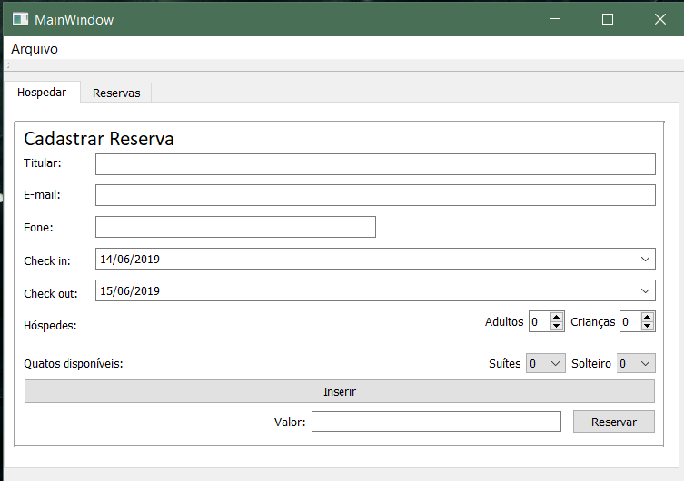
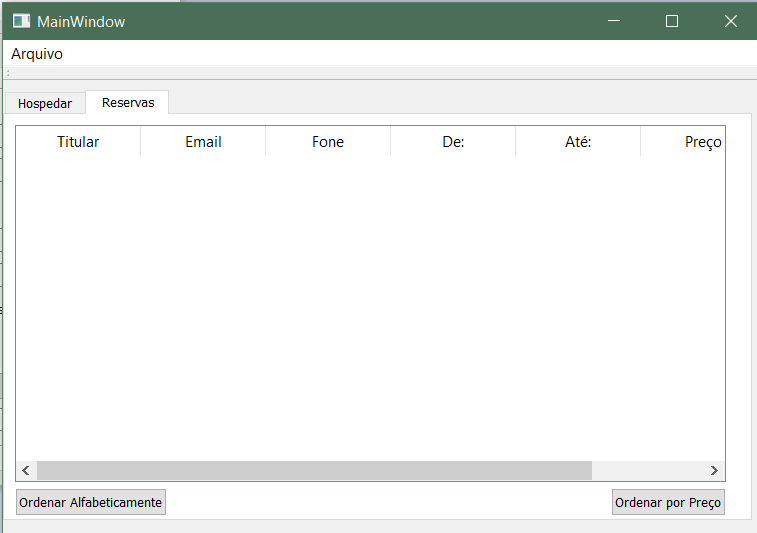
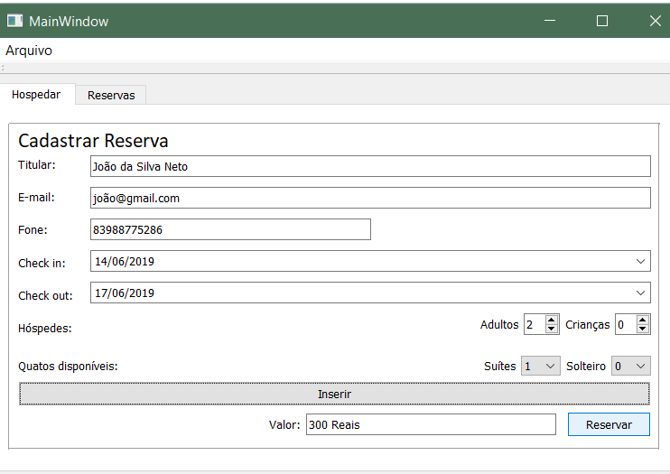
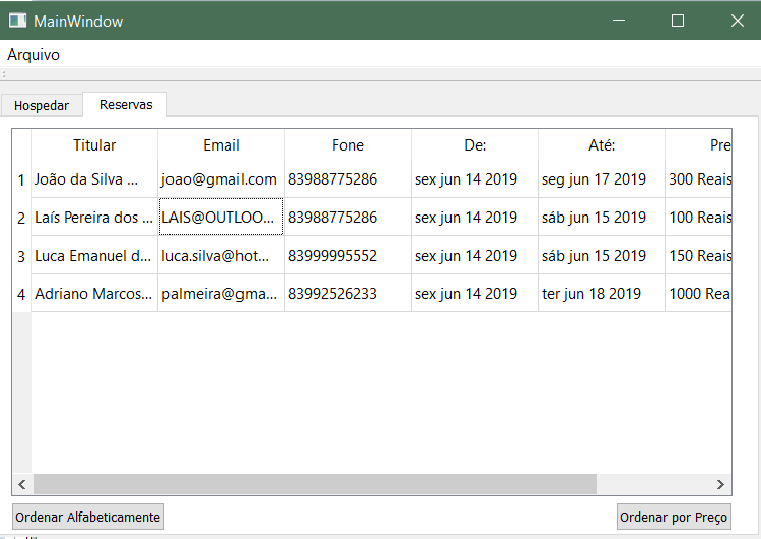
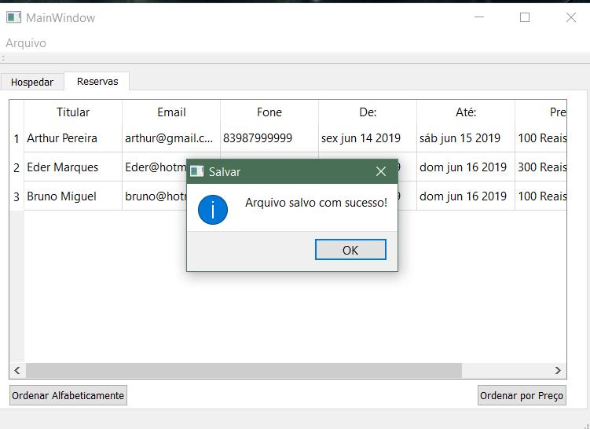

# Reserva-em-Hotel
# Projeto feito para a Disciplina de Técnicas de Programação 2019.1 . Programa que cadastra hóspedes em rede de hotel.

---------------------------------------------------------------------------------------------------------------------------------------
O programa permite ao usuario cadastrar o nome , email, telefone, checkin,checkout,quantidade de hospedes e quartos desejados.

Além de possuir uma tabela com os as reservas já feitas, podendo ser ordenandas por custo total ou ordem alfabética.

---------------------------------------------------------------------------------------------------------------------------------------
# Manual para Uso

Ao cadastrar o hospede o botão "Inserir" deve ser pressionado para que o programa mostre o custo da hospedagem.
O cadastro do titular não pode ser feito com menos de três caracteres. Além disso, nenhuma das opções de dados pessoais podem ser preechidas em branco.

Ao pressionar "Reservar", os dados do usuário serão salvos na tabela que contém todas as reservas que foram feitas. 

_______________________________________________________________________________________________________________________________________
# Ordenando a tabela

 Na inferior da tabela há dois botões que ordenadam os dados por preço ou nome do usuário.
 
 
 -----------------
 Ordem Alfabética
 
 ----------------
 Ordem de custo
 
 _________________________________________________________________________________________________________________________________
# Menu Salva e Carregar

No Canto superior esquerdo tem a opção "salvar" e "carregar" arquivos ja criados.

